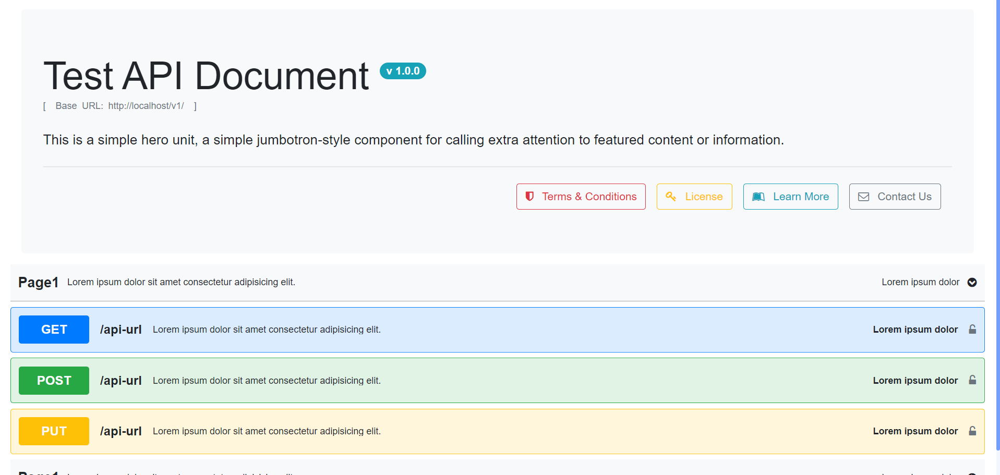

# JSADOC

Json API Documentation aka jsadoc is an application that provides instant documentation of APIs based on the JSON schema.

## How to run

Serve the application using any web server you like. For development server, it follows standard Angular `npm start` or `ng serve` command.

## How it works

- Step 1: Update `license.html` inside `/assets/files` folder. This file should contain the license if any for the API documentation or for the API itself. This license can be viewed by the users.
- Step 2: Similar to license.html, you can also update the `terms_n_conditions.html` file inside the same folder. This file is intented to provide the terms and conditions to use the APIs.

> License and Terms & Conditions are based on the organization/developers concent.

- Setp 3: Update `api_doc.json` based on the APIs that you have. Please follow the complete documentation to get complete reference on how and what to uodate in the JSON.

## JSON Contents

JSON have 2 Keys:
- header: which have all details related to the documentation introduction and meta data.
- group: Contains the list of API groups.

### Updating Header details

header key contains these fields:
| Key | Data Type | Description |
|---|---|---|
| title | string | Title of the Documentation |
| version | string | Version of the APIs |
| base_url | string | Base URL after which the APIs will follow |
| description | string | Description of the documentation |
| lisence | string | URL for the license file. `It should be an HTML content`. It can be an external resource as well |
| contact_email | string | Email of the contact person for the API related support |
| termsConditions | string | URL for the Terms & Conditions file. `It should be an HTML content`. It can be an external resource as well |
| learn_more_url | string | External resource to get more information to the APIs |

### Updating API group details

group containsa long chain of key-value pairs.

| Key | Data Type | Description |
|---|---|---|
| group_detail | object | Contains metadata related to the group. Refer to below sections related to it's use |
| api_list | object[] | It is a list of API objects. Refer to below sections related to it's use |

#### Updating group_detail

group_detail have these keys to be updated

| Key | Data Type | Description |
|---|---|---|
| name | string | Name of the API group |
| description | string | Description for the API group |
| other_details | string | Extra description for the API group |

#### Updating api_list

API list contains object defining individual API. Here we will see the contents of those objects

| Key | Data Type | Description |
|---|---|---|
| method | string | HTTP method for the API, values can be from 'GET', 'POST', 'PUT', 'PATCH', 'DELETE' |
| url | string | URL pattern for the API |
| description | string | Description of the API |
| other_details | string | Additional details related to API |
| can_try | boolean | If User is allowed to try URL directly from documentation * |
| parameters | object[] | Contains the list of parameter's object for the API |
| response | object | Object defining response related items |

##### Updating parameters

parameters is an array of objects each define different parameter for the API

| Key | Data Type | Description |
|---|---|---|
| key | string | Name of the parameter |
| is_required | boolean | true if it's a required field |
| type | string | Data type of the field, values can be from 'string', 'date', 'file', 'number', 'boolean', 'password' * |
| description | string | Description of the parameter |

##### Updating response

response defines different responses form the API

| Key | Data Type | Description |
|---|---|---|
| content_type | string | Response content type of the API |
| available_content_type | string[] | Possible response content types of the API * |
| messages | object[] | Examples of responses with different status codes defined individually  in an object |

###### Updating response

message defines response form the API

| Key | Data Type | Description |
|---|---|---|
| status_code | number | Status code for the response |
| description | string | Description of the Response |
| message | any | Response example |

> \* Functionality available only in Pro version. For pro version contact developer